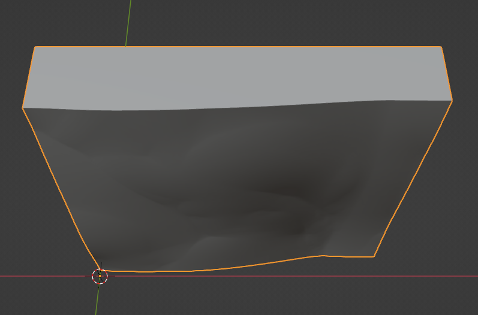
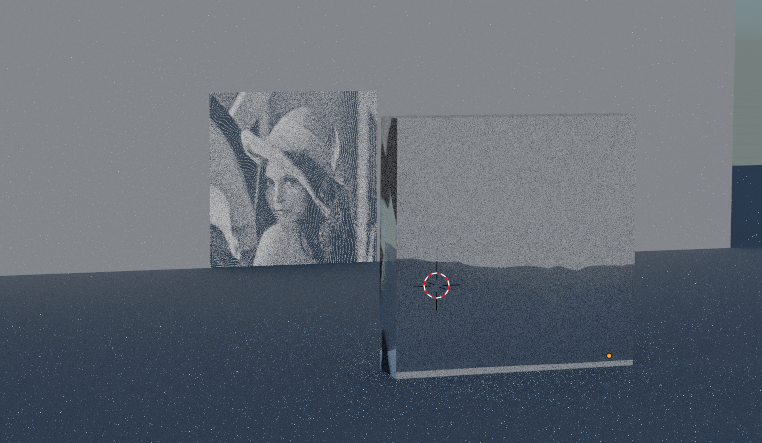
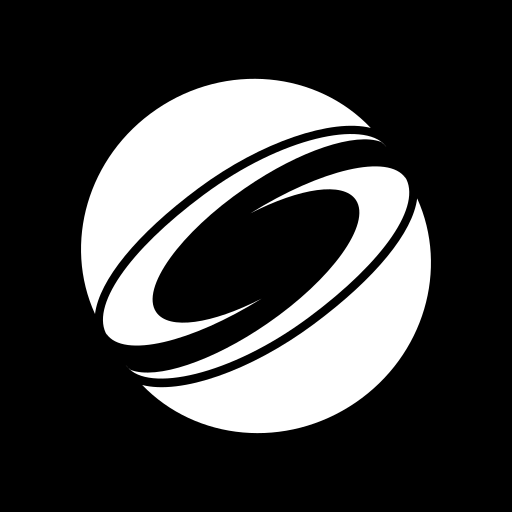
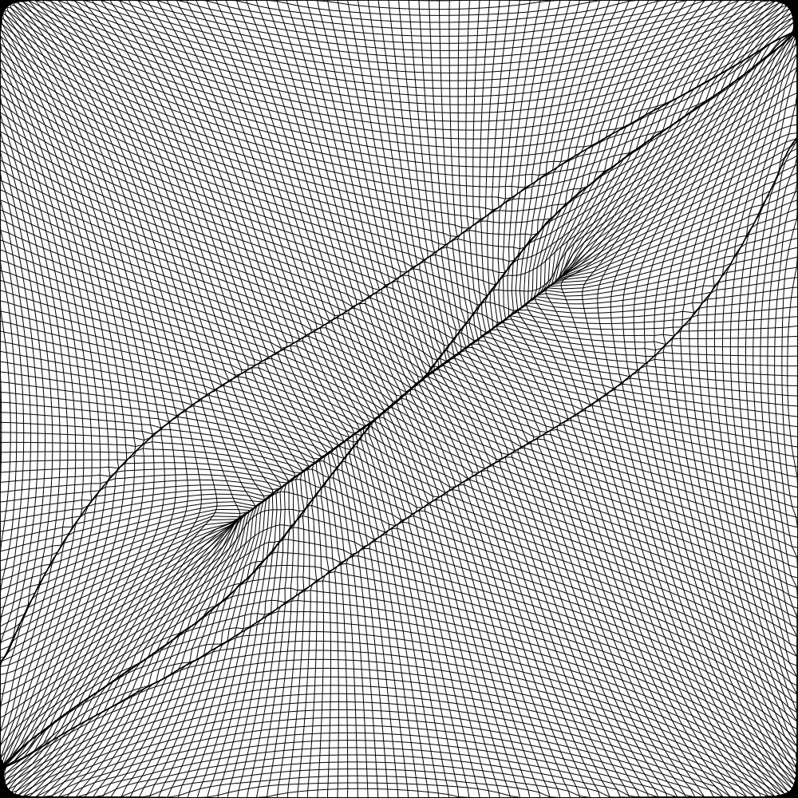
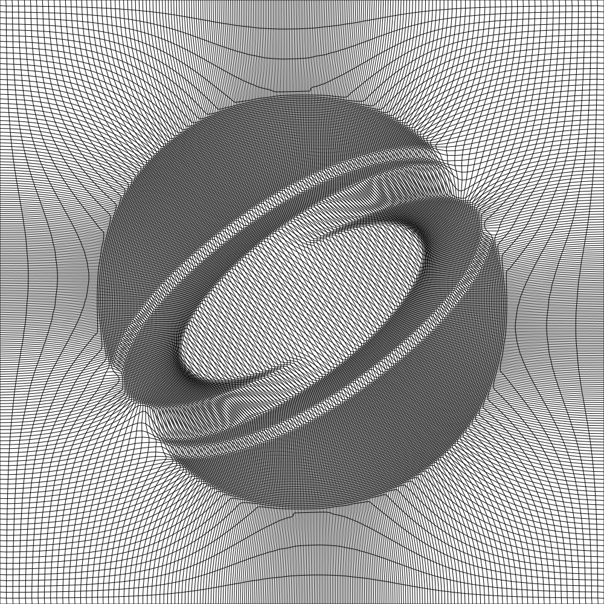
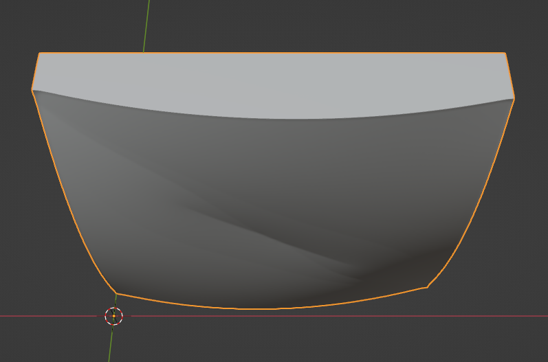
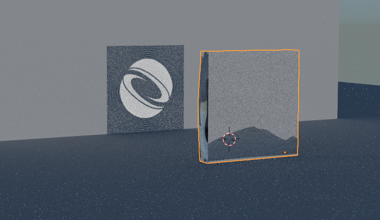

# Poisson-Based Continuous Surface Generation for Goal-Based Caustics

## Overview

This project implements the method described in the paper [Poisson-Based Continuous Surface Generation for Goal-Based Caustics](http://www.cs.columbia.edu/~yonghao/tog14/yue-continuous-caustics-lens.pdf).

## Features

- Implementation of the Poisson-based continuous surface generation algorithm.
- exports a solidified .obj
- the only c++17 non-standard dependancy is libpng
- can export the the inverse transport map

## Installation

### Prerequisites

- C++ compiler with C++17 support for your platform
- libpng (requires zlib)

### Building from Source: Unix

1. Clone the repository:

    ```bash
    git clone git@github.com:dylanmsu/caustic_engineering.git
    ```

2. Navigate to the project directory:

    ```bash
    cd caustic_engineering
    ```

3. Compile the source code:

    ```bash
    # create build directory
    mkdir build && cd build

    # generate build files
    cmake ..

    # build
    make
    ```

4. Run the code:
    ```bash
    ./CausticEngineering
    ```

### Building from Source: Windows
1. Clone the repository:

    ```bash
    git clone git@github.com:dylanmsu/caustic_engineering.git
    ```

2. Navigate to the project directory:

    ```bash
    cd caustic_engineering
    ```

3. Compile the source code:

    ```bash
    # create build directory
    mkdir build && cd build

    # generate build files (assumes C:/mingw64 to be the mingw64 path)
    & "C:/mingw64/bin/cmake.exe" -G "MinGW Makefiles" .. 

    # build
    & "C:/mingw64/bin/mingw32-make.exe"
    ```

4. Run the code:
    ```bash
    ./CausticEngineering.exe
    ```

## Usage

### Running the Program

1. Parameters:
    - ```bash
        --intput_png=[image path] # input image path
    - ```bash
        --res_w=[grid resolution] # mesh resolution in the x-axis
    - ```bash
        --width=[mesh width] # physical width of the mesh
    - ```bash
        --focal_l=[focal length] # focal length
    - ```bash
        --thickness=[lens thickness] # thickness of the final caustic lens
2. Execute the program:

    ```bash
    ./CausticEngineering.exe --intput_png=../img/siggraph.png --res_w=100 --width=0.5 --focal_l=1.5 --thickness=0.1
    ```

### Sample Output
<table style="width: 100%;">
  <tr>
    <th style="text-align: center;"></th>
    <th style="text-align: center;">input_image</th>
    <th style="text-align: center;">parameterization</th>
    <th style="text-align: center;">inverted parameterization</th>
    <th style="text-align: center;">3d_model</th>
    <th style="text-align: center;">simulation</th>
  </tr>
  <tr>
    <td style="text-align: center;">Lena</td>
    <td style="text-align: center;"></td>
    <td style="text-align: center;"></td>
    <td style="text-align: center;"></td>
    <td style="text-align: center;"></td>
    <td style="text-align: center;"></td>
  </tr>
  <tr>
    <td style="text-align: center;">Siggraph logo</td>
    <td style="text-align: center;"></td>
    <td style="text-align: center;"></td>
    <td style="text-align: center;"></td>
    <td style="text-align: center;"></td>
    <td style="text-align: center;"></td>
  </tr>
</table>
Lena:

transport from an image to an almost uniform distribution:


## Contributing

Contributions are welcome! If you'd like to contribute to this project, please follow these steps:

1. Fork the repository
2. Create a new branch (`git checkout -b feature`)
3. Make your changes
4. Commit your changes (`git commit -am 'Add new feature'`)
5. Push to the branch (`git push origin feature`)
6. Create a new Pull Request

## License

This project uses the MIT License.

## Acknowledgements

Thank you to Yue et al for their awesome research paper.

I would also like to thank Matt Ferraro for providing [their informative article](https://mattferraro.dev/posts/caustics-engineering) about the paper.

