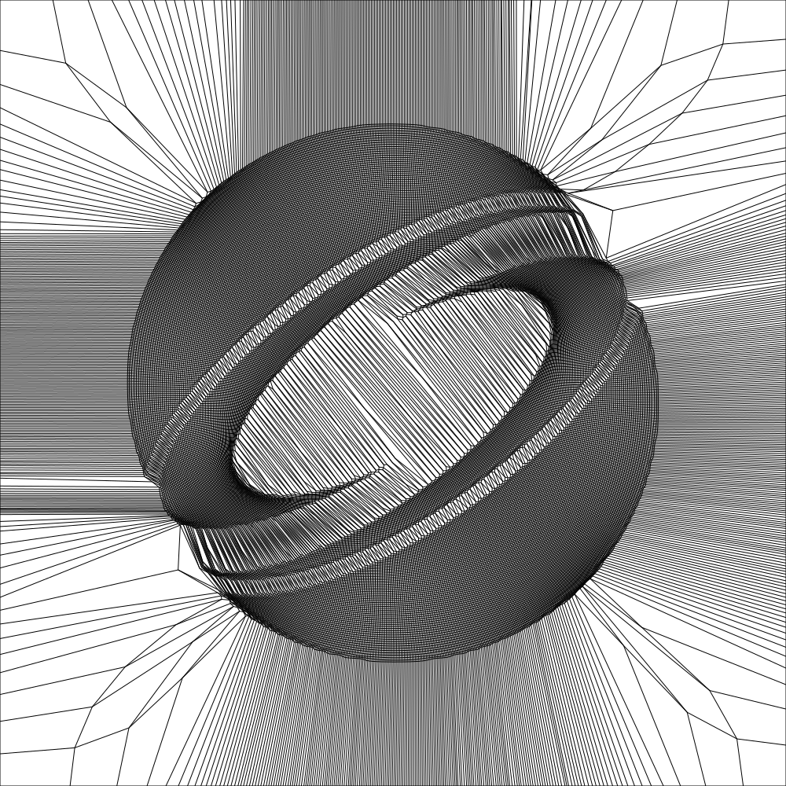

# Poisson-Based Continuous Surface Generation for Goal-Based Caustics

## Overview

This project implements and builds upon the method described in the paper [Poisson-Based Continuous Surface Generation for Goal-Based Caustics](http://nishitalab.org/user/egaku/tog14/continuous_caustics.pdf).

## What does it do?
With the code in this repository you can calculate the shape of a transparent window that casts an image if light passes through. 

It does that by modulating the angle of the surface across the entire surface to steer the light in the desired directions.

Result simulated with Blender using LuxRender:


## Features

- Implementation of the Poisson-based continuous surface generation algorithm.
- exports a solidified .obj
- the only c++17 non-standard dependancy is libpng
- can export the the inverse transport map
- multithreaded poisson solver

## Installation

### Prerequisites

- C++ compiler with C++17 support for your platform
- libpng (requires zlib)

### Building from Source: Unix

1. Clone the repository:

    ```bash
    git clone git@github.com:dylanmsu/caustic_engineering.git
    ```

2. Navigate to the project directory:

    ```bash
    cd caustic_engineering
    ```

3. Compile the source code:

    ```bash
    # create build directory
    mkdir build && cd build

    # generate build files
    cmake ..

    # build
    make
    ```

4. Run the code:
    ```bash
    ./CausticEngineering [parameters]
    ```

### Building from Source: Windows
1. Clone the repository:

    ```bash
    git clone git@github.com:dylanmsu/caustic_engineering.git
    ```

2. Navigate to the project directory:

    ```bash
    cd caustic_engineering
    ```

3. Compile the source code:

    ```bash
    # create build directory
    mkdir build && cd build

    # generate build files (assumes C:/mingw64 to be the mingw64 path)
    & "C:/mingw64/bin/cmake.exe" -G "MinGW Makefiles" .. 

    # build
    & "C:/mingw64/bin/mingw32-make.exe"
    ```

4. Run the code:
    ```bash
    ./CausticEngineering.exe [parameters]
    ```

## Usage

### Running the Program

1. Parameters:
    - ```bash
        --intput_png=[image path] # input image path
    - ```bash
        --res_w=[grid resolution] # mesh resolution in the x-axis
    - ```bash
        --width=[mesh width] # physical width of the mesh
    - ```bash
        --focal_l=[focal length] # focal length
    - ```bash
        --thickness=[lens thickness] # thickness of the final caustic lens
    - ```bash
        --max_threads=[max number of threads] # sets the maximum cpu threads for the poisson solver
2. Execute the program:

    ```bash
    ./CausticEngineering.exe --intput_png=../img/siggraph.png --res_w=100 --width=0.5 --focal_l=1.5 --thickness=0.1 --max_threads=16
    ```

### Sample Output
<table style="width: 100%;">
  <tr>
    <th style="text-align: center;"></th>
    <th style="text-align: center;">input_image</th>
    <th style="text-align: center;">parameterization</th>
    <th style="text-align: center;">inverted parameterization</th>
    <th style="text-align: center;">3d_model</th>
    <th style="text-align: center;">simulation</th>
  </tr>
  <tr>
    <td style="text-align: center;">Lena (Mesh: 256 x 256)</td>
    <td style="text-align: center;"></td>
    <td style="text-align: center;"></td>
    <td style="text-align: center;"></td>
    <td style="text-align: center;"></td>
    <td style="text-align: center;"></td>
  </tr>
  <tr>
    <td style="text-align: center;">Siggraph logo (Mesh: 200 x 200)</td>
    <td style="text-align: center;"></td>
    <td style="text-align: center;"></td>
    <td style="text-align: center;"></td>
    <td style="text-align: center;"></td>
    <td style="text-align: center;"></td>
  </tr>
  <tr>
    <td style="text-align: center;">Hello World (Mesh: 256 x 128)</td>
    <td style="text-align: center;"></td>
    <td style="text-align: center;"></td>
    <td style="text-align: center;"></td>
    <td style="text-align: center;"></td>
    <td style="text-align: center;"></td>
  </tr>
</table>

transport from an image to an almost uniform distribution:


## Prototype

Machined acrylic prototype:


Shadow of the machined prototype:


## Future plans

1. least squares solver for the heightmap -> this will allow more freedom in the lens design
2. reflective caustics -> is currently not that usefull because of the limited freedom in the height solver
3. circular caustic lenses
4. use the fast transport map algoritm from the paper: [https://gnader.github.io/publications/2018-ot-transport.html](Instant Transport Maps on 2D Grids)

## Contributing

Contributions are welcome! If you'd like to contribute to this project, please follow these steps:

1. Fork the repository
2. Create a new branch (`git checkout -b feature`)
3. Make your changes
4. Commit your changes (`git commit -am 'Add new feature'`)
5. Push to the branch (`git push origin feature`)
6. Create a new Pull Request

## License

This project uses the MIT License.

## Acknowledgements

Thank you to Yue et al for their awesome research paper.

I would also like to thank Matt Ferraro for providing [their informative article](https://mattferraro.dev/posts/caustics-engineering) about the paper.

